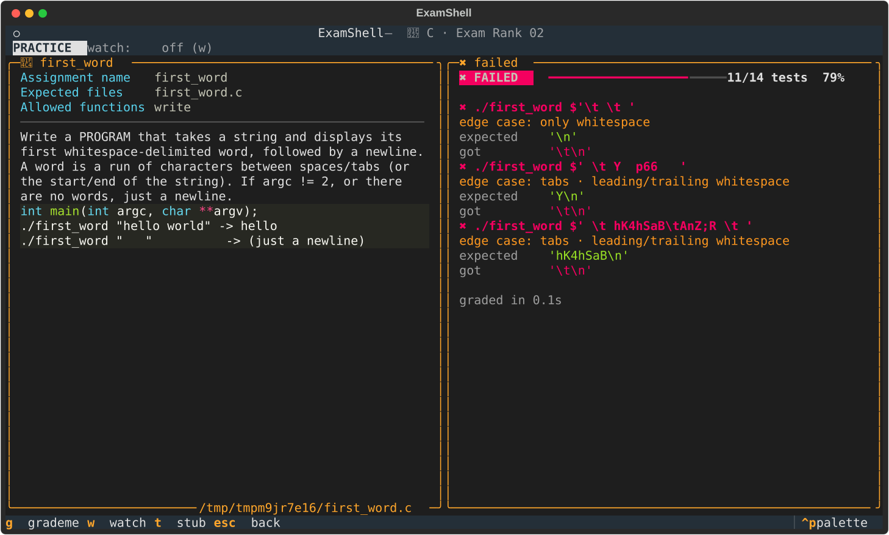

<div align="center">

# ⌨️ ExamShell

### Practice testers for the 42 Common Core exams

**🐍 Python · Exam Ranks 03 · 04 · 05** &nbsp;·&nbsp; **🔧 C · Exam Rank 02**

*Real sandboxed grading. Real edge cases. Real compiler. Zero internet required.*

[](https://github.com/jasuoh/42-exam-tester/actions/workflows/ci.yml)
[](LICENSE)


</div>

Draw a random exercise per level, write your solution, type `grademe`, and
only advance at **100 %** — graded as strictly as the real `examshell`, on
far more edge cases than you'd think to test yourself.

<p align="center">
  
</p>

## ⚡ Quick start

```bash
git clone https://github.com/jasuoh/42-exam-tester && cd 42-exam-tester

make run            # 🐍 Python · Exam Rank 03 — interactive menu (RANK=04 / 05 for the others)
make c-run          # 🔧 C · Exam Rank 02 — needs nothing but a C compiler

make install        # optional: colours + the full-screen app (installs rich & textual into ./venv)
make tui            # ✨ the full-screen app — make c-tui for C
```

No dependencies required — it runs on a bare exam machine with Python 3.8+.
The full-screen app is an optional extra (Python 3.9+); without it everything
works in the plain terminal UI.

## 🔁 A typical week

```bash
make c-readiness    # what could the exam still throw at you? (✔ passed · ✖ failed · · never tried)
make c-drill        # 5 exercises picked from your gaps
make c-exam FLAGS="--time-limit 180"   # full rehearsal, as strict as the real one, clock running
make sync           # take it all (progress, paused exam, solutions) to your other device
```

When a test fails you see exactly why — and how to reproduce it:

```
[KO] ./first_word $'  \tfoo bar'
     edge case: tabs · leading/trailing whitespace
     expected : 'foo\n'
     got      : '\tfoo\n'
```

## ✨ What you get

| | |
|---|---|
| 🎯 **Real exam rules** | levels in order, one random exercise each, 100 % to advance; the exam fails imports (Python) and compiler warnings / forbidden calls (C) like the real one, no redraws, optional countdown |
| 🎲 **Edge cases you forget** | curated cases **plus** random ones every run — tabs, runs of spaces, empty strings, wrong argc, negative numbers, `INT_MIN` |
| 🏖️ **Sandboxed grading** | Python runs in a subprocess with per-call timeouts; C is really compiled (`-Wall -Wextra`) and diffed against a reference — crashes, timeouts and 🧪 Valgrind leaks reported |
| 📈 **Knows your gaps** | readiness per level, a daily drill, stats, hints after 3 fails in a row (never during the exam) |
| ⏸️ **Life happens** | `quit` saves the exam, the next start resumes it; every run writes a Markdown report |
| 🧠 **Beyond the exam** | a separate LeetCode-style training pool per language |
| 🔄 **Continue on any device** | `make sync` carries your progress, paused exam and solutions through your own private git repo — school in the morning, laptop at night ([setup guide 🇩🇪](docs/sync.md)) |
| ✨ **Full-screen app** | subject and results side by side, **watch mode** re-grades every time you save, level stepper and countdown in the exam, readiness heatmap, stats with your streak — [screenshots](docs/features.md#-the-full-screen-app) |

| | 🐍 Python | 🔧 C |
|---|:---:|:---:|
| **Ranks / levels** | 03 (6 levels) · 04 (4) · 05 (3) | 02 (4 levels) |
| **Exercises** | 44 · 7 · 7 + 20 training | 60 + 9 training |
| **Your solutions** | `rendu/` | `c_rendu/` |
| **Start** | `make run` / `make exam` | `make c-run` / `make c-exam` |

## 📖 Documentation

| | |
|---|---|
| **[🐍 Python tester](docs/python.md)** | exam flow, the exercise pools per rank, how grading works, make targets, CLI |
| **[🔧 C tester](docs/c.md)** | function vs program exercises, the pool, fuzzing, Valgrind, make targets, CLI |
| **[🔄 Sync setup](docs/sync.md)** 🇩🇪 | connect your devices with `make sync`, step by step |
| **[🎛️ Shared features](docs/features.md)** | themes, stats, hints, readiness & drill, edge-case labels, reports, resume, updates |
| **[🚶 Tutorial](TUTORIAL.md)** | a step-by-step first session with real output |
| **[🛠️ Development](docs/development.md)** | testing the tool itself, code layout, releases |
| **[📝 Changelog](CHANGELOG.md)** · **[🗺️ Roadmap](PLAN.md)** | what changed, what's next |

`make` alone prints every command.

## 🗣️ Help make it match the real exam

Exercise pools differ between campuses and change over time — this tester is
only as good as the feedback it gets. If something here differs from your
real exam, please **[open an issue](https://github.com/jasuoh/42-exam-tester/issues/new/choose)**:

- **Exercise differs from the real exam** — wrong subject, missing exercise, wrong level, a case the real grader treats differently
- **Bug** — the tester itself misbehaves
- **Feedback** — what helped, what annoyed you, what you'd want

## 📄 License

[MIT](LICENSE) — do whatever you want with it, just keep the copyright notice.

<div align="center">

### 🍀 Good luck on the real exam

*Solve it, don't memorise it.*

</div>
