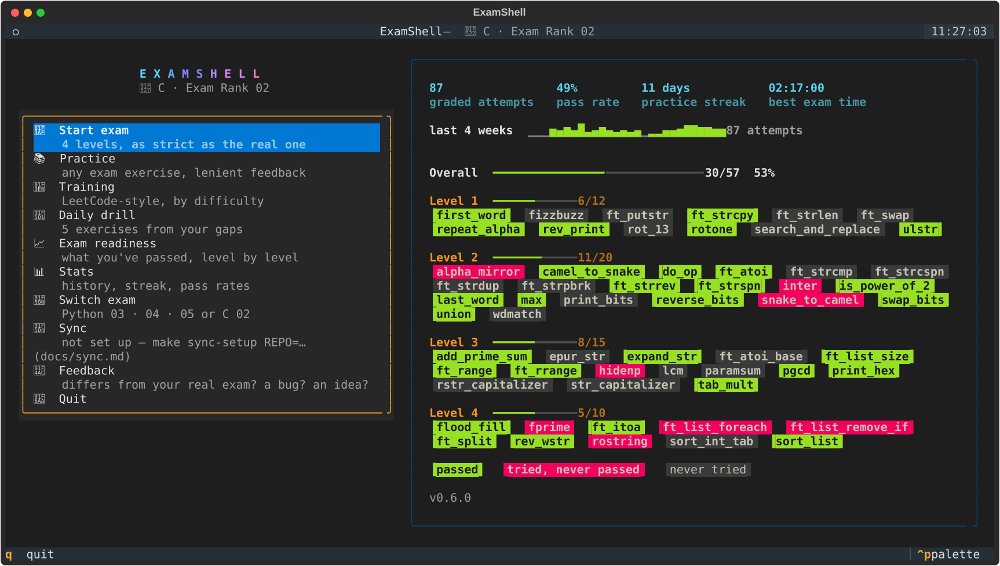
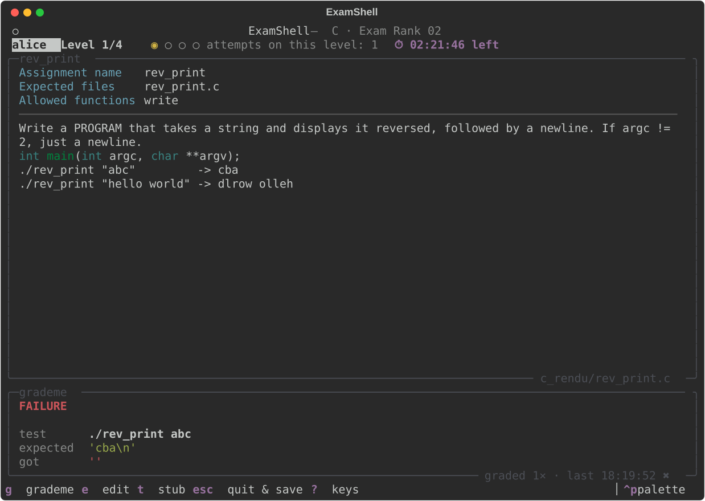
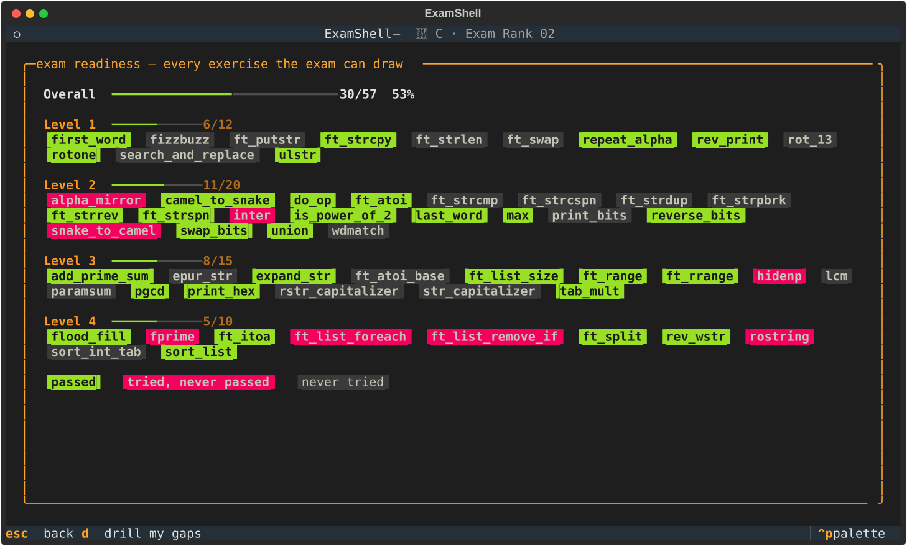
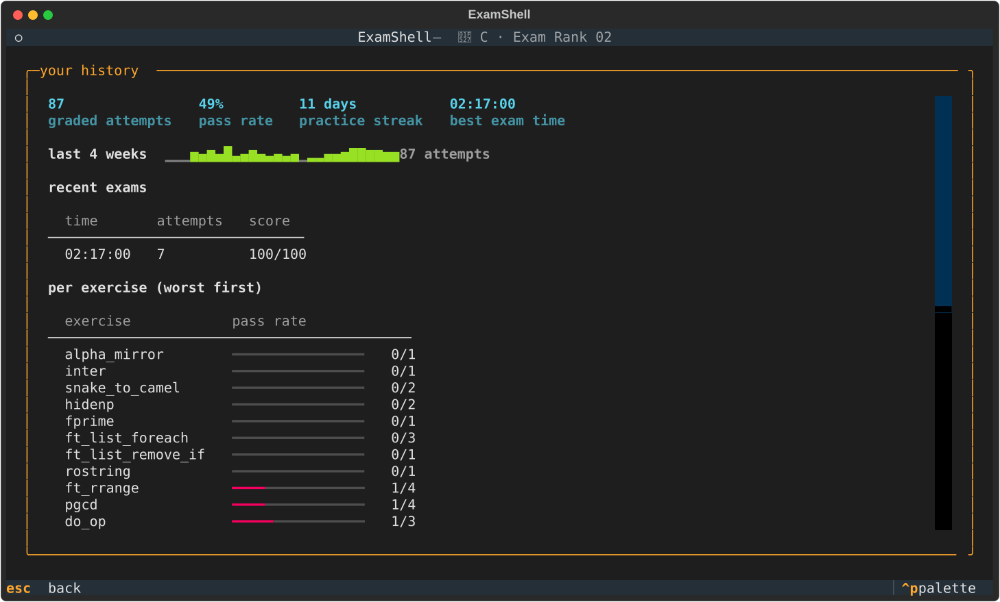

# 🎛️ Features shared by both testers

Themes, stats, hints, reports, resume, readiness & drill, edge-case labels, updates.

[← back to the README](../README.md)

---

## ✨ The full-screen app

```bash
make install        # once: rich + textual into ./venv (Python 3.9+)
make tui            # Python tester    ·  make c-tui for C
python3 -m c_exam --tui --exam          # straight into the exam
python3 -m examshell --tui --practice inter   # straight into one exercise
```

**🔀 Switch exam** in its menu moves between Python Rank 03 / 04 / 05 and
C Rank 02 without restarting, and **🔄 Sync** runs `make sync` in the
background. The exam you switch to is remembered (`~/.examshell/config.json`):
the next `make tui` opens on it again, C Rank 02 included, unless `RANK=`
picks a Python rank.

Everything the plain interface does, in one screen: the subject on the
left, grading results on the right, keys at the bottom. It drives exactly
the same engine — same rules, same grading, same stats, saves and reports —
so you can switch between the two whenever you like. Without Textual (or
on Python 3.8) `--tui` says why and falls back to the plain interface.

| Key | Where | |
|---|---|---|
| `g` | practice · exam | grade your solution |
| `w` | practice | **watch mode** — re-grade automatically every time you save the file |
| `t` | practice · exam | create the solution stub |
| `n` | drill | next exercise (in the exam only with `--relaxed`) |
| `/` | exercise lists | filter by name or function |
| `d` | readiness | start a drill from your gaps |
| `esc` | everywhere | back (in the exam: quit & save) |

<p align="center"></p>
<p align="center"></p>
<p align="center"></p>
<p align="center"></p>

The screenshots are generated by `tools/screenshots.py` from a made-up
practice history.

## 💬 Feedback (`examshell --feedback`)

`examshell --feedback exam` (or `make feedback KIND=exam`, `f` in the plain
menu, "💬 Feedback" in the full-screen app) opens the right GitHub issue form
with the tester version, the exam and — for a bug — your OS and Python
already filled in. In practice, `feedback` (plain) or `f` (full-screen)
also fills in the exercise you're on, for "this differs from my real
exam". Nothing is sent automatically: it only opens a link, and you submit
the form yourself. Where no graphical browser exists it just prints the
link (the full-screen app also copies it to the clipboard).

## 🩺 `examshell --doctor` / `make doctor`

Checks this machine in one go — Python version, how the tester is installed
and whether an update is out, rich and Textual, a C compiler that **really
compiles and runs** a test program, valgrind, git, the data folder and the
sync setup — and prints the one command that fixes anything that's off.
Exit code 1 only when something is actually broken.

## 🔄 Continue on another device (`make sync`)

**→ Step-by-step setup: [sync.md](sync.md) · 🇩🇪 [sync.de.md](sync.de.md)**

Practise on campus, carry on at home — with the same history, the same
paused exam and the same solution files. Everything goes through **your
own private git repository**; there is no server of ours in between.

**Once:** create an empty **private** repository (e.g. on GitHub, call it
`examshell-progress`), then on **each** device:

```bash
make sync-setup REPO=git@github.com:<you>/examshell-progress.git
```

**Then:** `make sync` when you stop on one device and when you start on the
other. One `make sync` covers both testers. It uses your normal git login
(SSH key or credential helper).

| What | How two devices' versions are combined |
|---|---|
| practice history | every attempt from both sides, nothing lost |
| paused exam | the newer one wins — and an exam you finished stays finished |
| exam reports | all of them |
| `rendu/`, `c_rendu/` | per file the **newer edit wins**; the older version is kept in `~/.examshell/sync-backup/` so code is never lost |
| settings (`config.json`) | not synced — the compiler etc. are per device |

The tester combines the two sides itself and then commits and pushes — you
never have to resolve a git conflict. Keep the repository **private**: it
holds your solutions, and sharing solutions can count as cheating at 42.

**Without git:** point `EXAMSHELL_HOME` at a folder that iCloud / Dropbox /
Nextcloud already syncs (`export EXAMSHELL_HOME=~/Dropbox/examshell`). That
carries history, paused exams and reports — your solution folders you'd sync
yourself.

### 🙈 Blind grading

`--blind` (exam only) makes grading tell you **how many** tests failed but
not **which inputs** — closer to the real exam, where finding your own edge
cases is part of the job. Works in both interfaces.


Everything below lives in `examshell/settings.py`, `examshell/stats.py`,
`examshell/session_store.py` and `examshell/report_export.py` — one small shared layer
used by **both** `python3 -m examshell` and `python3 -m c_exam`, so it works the
same way and stores its files in the same place (`~/.examshell/`) no matter
which tester you're using. None of it is required reading: the exam and
practice flow work exactly as before if you never touch any of this.

Everything here is **best-effort**: if `~/.examshell/` can't be created or
written to (a locked-down exam machine, a read-only `$HOME`), these features
just silently do nothing — they never make grading fail.

### 🎨 Themes

Three colour themes, picked with `--theme`:

| Theme | For |
|---|---|
| `dark` (default) | the original palette — bright colours, dark terminal background |
| `light` | a white/light terminal background (darker, more saturated colours so nothing washes out) |
| `highcontrast` | colour-blind friendly — swaps the usual red/green pass-fail colours for the [Okabe–Ito](https://jfly.uni-koeln.de/color/) blue/vermillion/orange palette, which stays distinguishable under the common forms of colour-vision deficiency |

```bash
python3 -m examshell --theme highcontrast     # try it for one run
python3 -m examshell --theme light --save-config   # remember it for every future run
```

`--save-config` writes `--theme` (and `--timeout`/`--fuzz`/`--show-fails`,
`--cc` for the C tester) to `~/.examshell/config.json` and exits — no exam
or practice session starts. From then on, any run that doesn't pass the
flag explicitly picks up the saved value; an explicit flag on the command
line always wins over the saved one.

### 📊 Local stats

Every `grademe` (in an exam or in practice) and every `--grade` appends one
line to `~/.examshell/stats.jsonl` — purely local, never sent anywhere.

```bash
python3 -m examshell --stats      # or: make stats
python3 -m c_exam --stats   # or: make c-stats
```

Shows your overall attempts and pass rate, your best full-exam completion
time, and a per-exercise breakdown (`3/7 passed`, …) — a quick way to see
which exercises you actually need more reps on.

### 💡 Stuck? A small nudge, not a spoiler

Fail the **same** exercise three times in a row in practice/training mode
(tracked via the local stats above) and the next failing report ends with
one hedged, one-line hint — never the answer, just a push in the right
direction:

```
✖  ████████░░░░░░░░  17/36 tests passed   47%
💡 Think about the edge cases first: 0, 1 and negative numbers are never
   prime — if it's only wrong for small n, that's almost always it.
```

Two sources, in order: a hand-written hint on the exercise itself when one
exists (a growing set — not every exercise has one yet), otherwise a
generic guess from the shape of the failure alone (off-by-one, a sign
flip, an unhandled empty-input case, a crash pointing at memory rather
than logic, a leak Valgrind caught, an infinite loop). The generic one is
a heuristic, not a diagnosis — it's phrased as "could be", and stays
silent rather than guess wrong when nothing matches.

A curated hint can also react to *which kind* of failure it was, instead
of always saying the same thing: a crash and a Valgrind leak on the same
exercise usually call for different advice (e.g. `ft_split` points at a
missing NULL-terminator slot for a crash, but a missing free on an error
path for a leak), so the exercise can define one hint per failure kind
instead of a single fixed string.

**Never shown during `--exam`** —
getting unstuck without a crutch under time pressure is part of what the
exam actually tests, so practice/training is where this builds that
muscle instead of short-circuiting it.

### 📄 Session reports

Every exam run — passed or aborted — writes a small Markdown summary to
`~/.examshell/reports/` (login, score, time, per-level attempts/time, any
badges earned) and prints the path at the end. Nothing to configure; it's
just a record you can keep, diff between attempts, or paste into a study
log.

### ⏸️ Resuming an aborted exam

`quit` during an exam now saves your progress (level, passed exercises,
the exercise currently drawn, attempts, elapsed time) to
`~/.examshell/saved_exam_py.json` (`saved_exam_c.json` for the C tester).
The next time you start an exam, you're asked whether to resume:

```
Resume saved exam for alice — level 3? [Y/n]:
```

Say no (or let the exam finish normally) and the save is discarded. The
clock keeps running while the exam is saved — like in the real exam, a
pause counts — so with `--time-limit` a resume can end straight away with
"TIME'S UP". This is a convenience for closed laptops and accidental `quit`s, not a way to
game the real exam's rules — the real moulinette has no resume button
either.

### 📈 Exam readiness & daily drill

`--stats` tells you how you did; these two tell you **what to do next**.

```bash
make readiness        # python3 -m examshell --readiness   (C: make c-readiness)
make drill            # python3 -m examshell --drill        (C: make c-drill, N=3 for 3)
```

**Readiness** lists every exercise the exam can actually draw, level by
level — ✔ passed at least once, ✖ tried but never passed, · never tried —
plus a per-level and overall score and the level with the biggest gap.
A pass in the exam, in practice or via `make grade` all count.

**Drill** builds a short session (5 exercises by default) from your own
history and walks you through them one by one in practice mode: your weak
spots first (at most half the session, so it's never a wall of failures),
then exercises you've never tried, then the ones you passed longest ago —
a light form of spaced repetition. Only exercises the real exam can draw
are ever picked.

### 🔍 Edge-case labels on failing tests

Every failing test names the edge case its input represents, and C
programs show the exact command to rerun it (tabs spelled out with
`$'…'`):

```
[KO] ./first_word $'  \tfoo bar'
     edge case: tabs · leading/trailing whitespace
     expected : 'foo\n'
     got      : '\tfoo\n'
```

The labels only describe the *input* (`empty string`, `only whitespace`,
`tabs`, `repeated spaces`, `zero`, `negative number`, `INT_MIN/INT_MAX`,
`empty list`, `single element`, `no arguments`) — they never guess at
your bug.

### 🔔 Staying up to date

The interactive menu checks GitHub for a newer release at most once a day,
in a background thread (so a slow or missing network never delays
anything; an offline machine just never shows the notice). When there is
one, the menu says so — `make update` (`git pull --ff-only`) gets it, and
`--version` shows what you have. Nothing about you is sent: it's one
anonymous request for the latest release tag. Turn it off with
`--no-update-check` or `EXAMSHELL_NO_UPDATE_CHECK=1`.

Releases publish themselves: when a merge to `main` changes the version in
`examshell/version.py`, `.github/workflows/release.yml` runs the tests,
creates the tag `vX.Y.Z` and a GitHub Release with that version's
[CHANGELOG](../CHANGELOG.md) section as notes and the package files
attached.

### 🔎 Fuzzy search in the exercise picker

Practice mode's and Training mode's exercise pickers accept `/text` as a
quick filter — type `/` followed by part of an exercise or function name
to narrow the list, `/` alone to clear it:

```
Selection (number, /text to filter, or 'b' to go back): /matrix
```

### 🏅 Achievements

Shown at the end of a **passed** exam, in the summary panel and in the
saved report: 🏅 *Flawless* (every level cleared on the first `grademe`),
🎉 *First full clear!* (your first ever 100% run for that tester), and ⏱
*New personal best time!* (faster than any previous completion) — bragging
rights only, they don't affect scoring.

**→ [TUTORIAL.md](../TUTORIAL.md)** walks through the above
step by step, with real command output.
