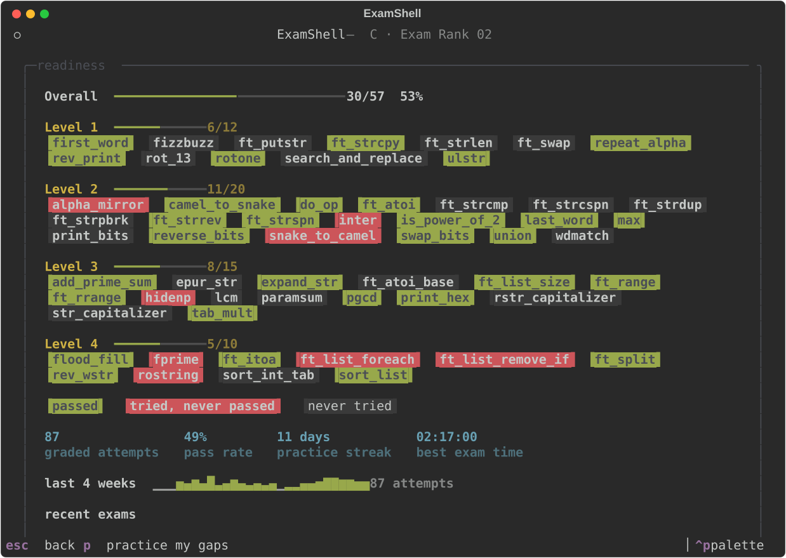

# Features

Everything ExamShell does, in one place. Both testers (C Rank 02 and
Python Rank 03 / 04 / 05) share all of it, and everything they store lives
in `~/.examshell/` — or wherever `EXAMSHELL_HOME` points.

[← back to the README](../README.md)

## The app

`make` opens it (the first time it also installs it and asks which exam
you're practising for). It's made for a terminal next to your editor:
subject on top, results below.

| Menu | |
|---|---|
| **Exam** | the real exam rules — see [below](#the-exam) |
| **Practice** | any exercise, full feedback; tabs *Exam exercises* · *My gaps* · *Extra* (`tab` switches) |
| **Progress** | readiness per level and your history; `p` practises your gaps |
| **Switch exam** | C Rank 02 or Python Rank 03 / 04 / 05 — the next start opens on it again |

| Key | Where | |
|---|---|---|
| `g` | practice · exam | grademe |
| `e` | practice · exam | open your solution: VS Code if its `code` command is installed, else `$VISUAL` / `$EDITOR` in the terminal; writes a stub first if there's no file |
| `t` | practice · exam | write a stub (never overwrites) |
| `d` | practice | every detail of the last grade, and back |
| `n` | practice | next exercise of *My gaps* |
| `f` | menu · practice | report an exercise that differs from your real exam |
| `o` | menu | settings |
| `s` | menu | sync |
| `/` | practice list | filter by name |
| `q` | menu | quit |
| `esc` | screens, dialogs | back (in the exam: quit & save) |
| `?` | everywhere | all the keys |

To copy text, drag over it with the mouse and press ctrl+c. Terminals that
support OSC 52 (Ghostty, kitty, iTerm2, WezTerm) get it directly; for the
others (GNOME Terminal, macOS Terminal, xterm) the app uses the system
clipboard tool — on Linux install `wl-clipboard` or `xclip` / `xsel` for
that (beta). The app uses your terminal's colours.

Without Textual (or on Python 3.8) the testers fall back to a plain
line-based menu with the same exam and practice.

## The exam

- Levels in order, one exercise drawn per level, **100 %** to move on.
- `grademe` says **SUCCESS**, or **FAILURE** with a trace of the first
  failing test (test / expected / got) — no hints, no other failures.
- A failed level keeps its exercise until it passes; there is no redraw.
- Python: any import fails, like the real moulinette. C: compiler warnings
  and calls outside the allowed functions fail.
- **A new exam, new exercises:** each level is dealt like a shuffled deck
  across exams — you get every exercise of a level once before any comes
  back (remembered in `exam_draws_<tool>.json`).
- **A new exam starts from an empty `rendu/`:** earlier solutions to exam
  exercises move to `rendu/archive/<date-time>/`.
- **Quit any time** (`esc`): the exam is saved and the next start offers to
  resume it. The clock keeps running while it's saved — a pause counts,
  like in the real exam.
- **Time limit:** set it in Settings (`o`); when it runs out the exam ends
  with *TIME'S UP*.

## Practice

- A grade shows one verdict line and the first three failing tests one line
  each — the call, the edge case its input represents, `got ≠ expected`.
  `d` shows them all with full values.
- **Edge-case labels** describe the input (`empty string`, `tabs`,
  `repeated spaces`, `INT_MIN`, `no arguments` …), never guess at your bug.
- **Stuck?** Fail the same exercise three times in a row and the result
  ends with a one-line hint — a push, never the answer. Never in the exam.
- **My gaps:** up to five exercises from your history — weak spots first
  (at most half), then never tried, then what you passed longest ago.
  Only exercises the exam can draw.
- **Extra:** the exam banks' extra exercises and a LeetCode-style training
  pool. The exam never draws them.

## Progress

Every exercise the exam can draw, level by level: passed at least once,
tried but never passed, never tried. Below it: attempts, pass rate, streak,
the last four weeks and your exam times. A pass in the exam, in practice or
via `--grade` all count. All of it comes from `stats.jsonl`, which never
leaves your machine (unless you sync it).

## Settings (`o`)

Saved in `config.json`, applied right away:

| | |
|---|---|
| Exam time limit | minutes, or off |
| Time per test | seconds before a test counts as a timeout |
| Random tests per exercise | on top of the fixed cases |
| C compiler | `cc`, `gcc`, `clang` … (C exam only) |
| Sync repo | connect this device to your private repo |
| Auto-sync | pull when a session starts, push when it ends |

## Sync

**→ Step by step: [sync.md](sync.md) · 🇩🇪 [sync.de.md](sync.de.md)**

Practise on campus, carry on at home — same history, same paused exam,
same solution files — through **your own private git repository**; there is
no server of ours in between. Add the repo once per device in Settings,
then `s` syncs (or turn on auto-sync).

| What | How two devices' versions are combined |
|---|---|
| practice history | every attempt from both sides |
| paused exam | the newer one wins — an exam you finished stays finished |
| `rendu/`, `c_rendu/` | per file the newer edit wins; the older one is kept in `~/.examshell/sync-backup/` |
| settings | not synced — the compiler etc. are per device |

Keep the repository **private**: it holds your solutions, and sharing
solutions can count as cheating at 42.

**Without git:** point `EXAMSHELL_HOME` at a folder iCloud / Dropbox /
Nextcloud already syncs. That carries history and paused exams; your
solution folders you'd sync yourself.

## Feedback

`f` (or `python3 -m examshell --feedback exam`) opens the right GitHub issue form with
the tester version, the exam and — in practice — the exercise filled in.
Nothing is sent automatically: you submit the form yourself. Without a
browser the link is shown and copied.

## If the app crashes

An unexpected error ends the app — but first it writes the traceback to
`~/.examshell/crash.log`. The next start asks whether to report it: yes
opens the GitHub bug form with the error filled in (nothing is sent until
you submit it). Either way the log is kept as `crash.log.seen`.

## Doctor

`make doctor` checks the machine in one go — Python, how the tester is
installed and whether an update is out, Textual, a C compiler that really
compiles and runs, valgrind, git, the data folder and sync — and prints
the command that fixes what's off.

## Updates

The menu checks GitHub for a newer release at most once a day, in the
background (one anonymous request for the latest tag; offline it just stays
quiet); the menu's side panel says when there is one (wide terminals),
`make doctor` always does. `make update` gets it. Off with `EXAMSHELL_NO_UPDATE_CHECK=1`.

## Best effort

If `~/.examshell/` can't be written (a read-only `$HOME`), stats, saves and
settings quietly do nothing — they never make grading fail.
